# YourPetHealth API - Sistema de Gestão Veterinária

Projeto desenvolvido em Java utilizando Spring Boot, Maven, JPA/Hibernate e Oracle Database para gerenciamento de responsáveis, pets, consultas veterinárias e histórico clínico através de operações CRUD (Create, Read, Update e Delete).

---

# Objetivo

A aplicação tem como objetivo auxiliar no gerenciamento clínico veterinário, permitindo:

- Cadastro de responsáveis
- Cadastro de veterinários
- Cadastro de pets
- Agendamento e gerenciamento de consultas
- Controle de histórico clínico dos pets

A API foi desenvolvida utilizando arquitetura REST e persistência em banco de dados Oracle.

---

# Tecnologias Utilizadas

- Java 21
- Spring Boot
- Maven
- Spring Data JPA
- Hibernate
- Oracle Database
- Swagger

---

# Cronograma de Desenvolvimento

## Cronograma do Projeto

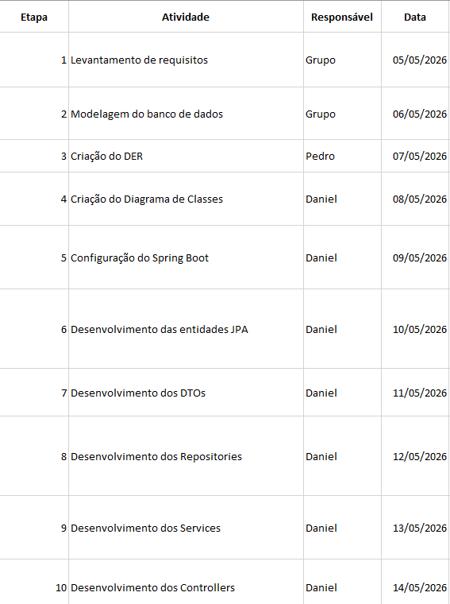
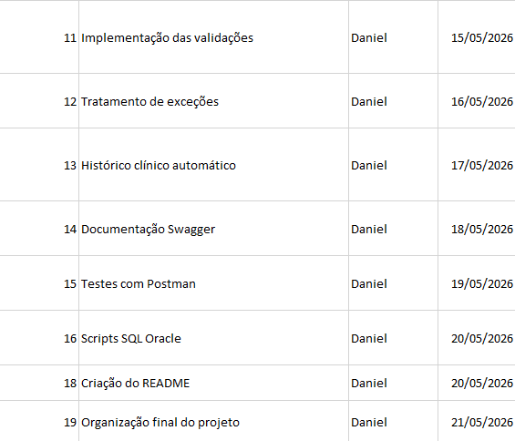

---

## Organização das Atividades

O cronograma foi elaborado para organizar as etapas do desenvolvimento da aplicação, incluindo:

- modelagem do banco de dados
- desenvolvimento backend
- documentação Swagger
- criação dos diagramas
- testes da API
- organização final do projeto

Todas as atividades foram desenvolvidas seguindo o planejamento definido para o projeto.

---

# Arquitetura da Aplicação

O projeto foi desenvolvido seguindo arquitetura em camadas, separando responsabilidades para facilitar manutenção, escalabilidade e organização do código.

## Diagrama da Arquitetura

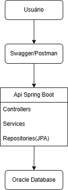

---

## Camadas da Aplicação

### Controller

Responsável por receber as requisições HTTP da API REST e retornar as respostas ao cliente.

Exemplos:
- `PetController`
- `ConsultaController`
- `VeterinarioController`

---

### Service

Responsável pelas regras de negócio da aplicação.

Exemplos:
- validações
- atualização de status
- geração de histórico clínico
- verificações de existência de registros

---

### Repository

Responsável pela comunicação com o banco de dados utilizando Spring Data JPA.

As interfaces Repository realizam operações como:
- salvar
- buscar
- atualizar
- deletar registros

---

### Entity

Representação das tabelas do banco de dados através de entidades JPA.

Exemplos:
- `Pet`
- `Consulta`
- `HistoricoClinico`
- `Responsavel`
- `Veterinario`

---

### DTO

Responsável pela transferência de dados entre cliente e API.

Utilizado para:
- cadastro
- atualização
- listagem de informações

---

# Estrutura do Projeto

```text
src/main/java/br/com/yourpethealth

├── controller
├── dto
├── entity
├── repository
├── service
├── exception
```

---

# Diagrama de Classes das Entidades

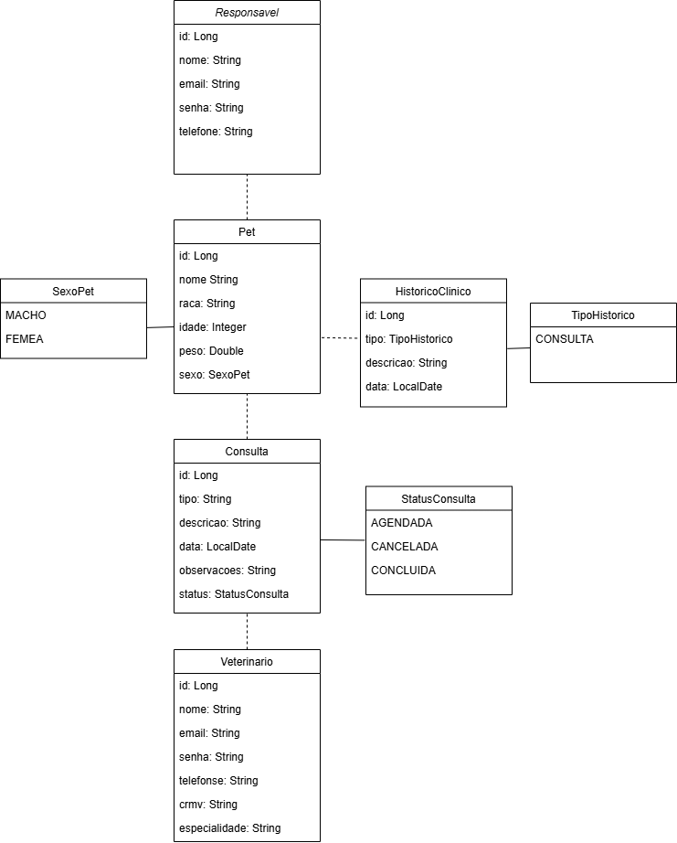


---

# Diagrama Entidade Relacionamento (DER)

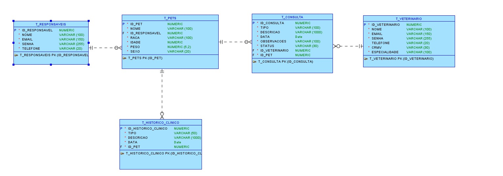

---

# Funcionalidades da API

## Responsáveis

Permite:

- cadastrar responsáveis
- listar responsáveis
- buscar responsável por ID
- atualizar dados
- remover responsáveis

---

## Veterinários

Permite:

- cadastrar veterinários
- listar veterinários
- buscar veterinário por ID
- atualizar informações
- remover veterinários

---

## Pets

Permite:

- cadastrar pets vinculados a um responsável
- listar pets
- buscar pets por responsável
- atualizar informações
- remover pets

---

## Consultas

Permite:

- cadastrar consultas veterinárias
- listar consultas
- buscar consultas por pet
- buscar consultas por veterinário
- atualizar consultas
- concluir consultas
- remover consultas

Ao concluir uma consulta, o sistema automaticamente registra a consulta no histórico clínico do pet.

---

## Histórico Clínico

Permite:

- listar histórico clínico de um pet
- buscar histórico por ID
- remover registros do histórico

---

# Relacionamentos do Sistema

## Responsável → Pet

Um responsável pode possuir vários pets.

Relacionamento:

- OneToMany

---

## Pet → Consulta

Um pet pode possuir várias consultas veterinárias.

Relacionamento:

- OneToMany

---

## Veterinário → Consulta

Um veterinário pode realizar várias consultas.

Relacionamento:

- OneToMany

---

## Pet → Histórico Clínico

Um pet pode possuir vários registros clínicos.

Relacionamento:

- OneToMany

---

# Banco de Dados

O sistema utiliza Oracle Database para persistência das informações.

As principais tabelas são:

- `t_responsaveis`
- `t_veterinarios`
- `t_pets`
- `t_consultas`
- `t_historico_clinico`

---

# Constraints Utilizadas

O banco utiliza constraints para garantir integridade dos dados.

## Primary Key (PK)

Responsável pela identificação única dos registros.

---

## Foreign Key (FK)

Responsável pelos relacionamentos entre as tabelas.

Exemplos:

- pet vinculado ao responsável
- consulta vinculada ao pet
- consulta vinculada ao veterinário

---

## UNIQUE

Impede duplicidade de informações importantes.

Exemplos:

- e-mail
- CRMV

---

## CHECK

Valida valores específicos.

Exemplos:

- sexo do pet
- status da consulta

---

# Endpoints da API

## Base URL

```http
http://localhost:8080
```

---

# Swagger

A documentação da API pode ser acessada através do endereço:

```http
http://localhost:8080/swagger-ui/index.html
```

---

# Exemplos de Endpoints

## Responsáveis

### Post:
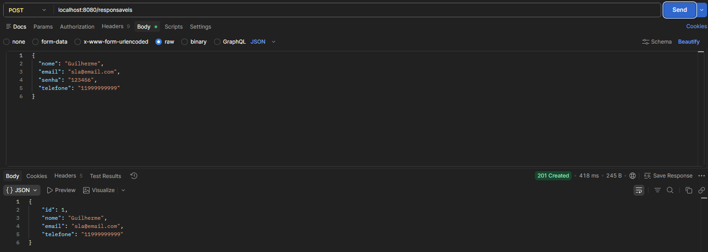

## Veterinários

### Post:
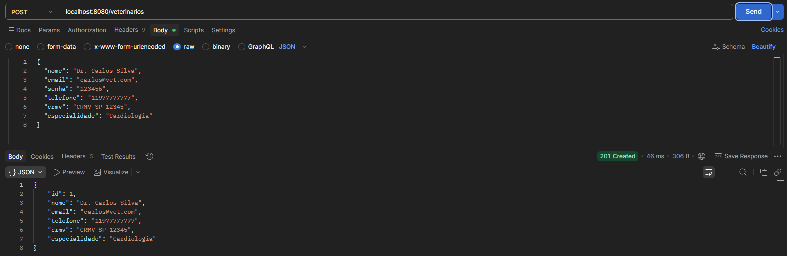

## Pets

```http
GET /pets
POST /pets
GET /pets/{id}
PUT /pets/{id}
DELETE /pets/{id}
```
### Post:
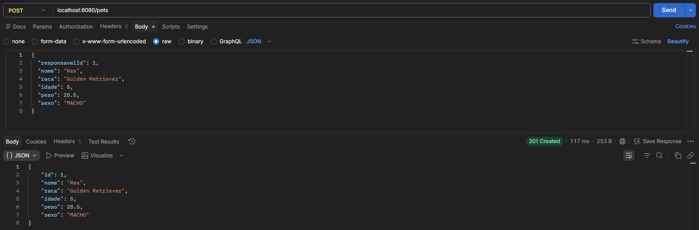
---

## Consultas

```http
GET /consultas/{id}
POST /consultas
PUT /consultas/{id}
PATCH /consultas/{id}/concluir
DELETE /consultas/{id}
```
### Post:
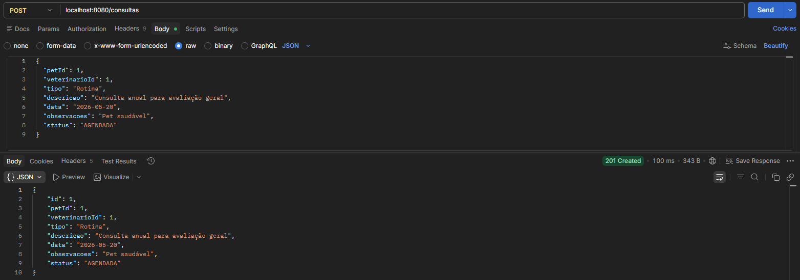

### Patch:
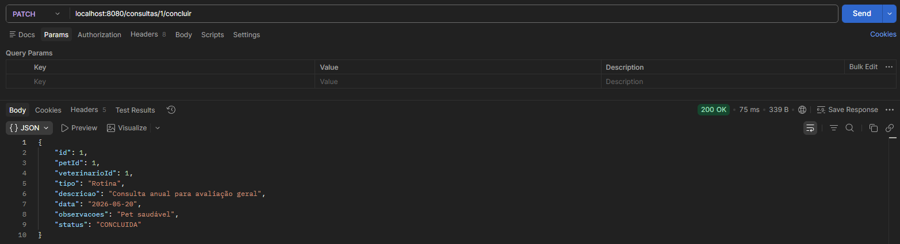

---

## Histórico Clínico

```http
GET /historico/pet/{petId}
GET /historico/{id}
DELETE /historico/{id}
```

### Get:
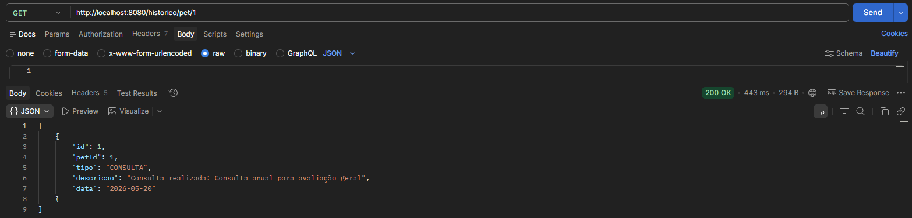

---

# Testes da API

Os endpoints foram testados utilizando:

- Postman (Arquivo para importar os testes está na pasta documentos)
- Swagger UI

Foram realizados testes de:

- cadastro
- consulta
- atualização
- exclusão
- validações
- tratamento de erros

---

# Tratamento de Exceções

A aplicação possui tratamento de exceções para:

- registros não encontrados
- dados inválidos
- erros de validação
- inconsistências de negócio

---

# Como Executar o Projeto

## 1. Clonar o Repositório

```bash
git clone <repositorio>
```

---

## 2. Configurar Banco Oracle

Configurar as credenciais do banco de dados no arquivo de propriedades da aplicação.

---

## 3. Executar a Aplicação

Executar a classe principal Spring Boot.

---

## 4. Acessar Swagger

```http
http://localhost:8080/swagger-ui/index.html
```